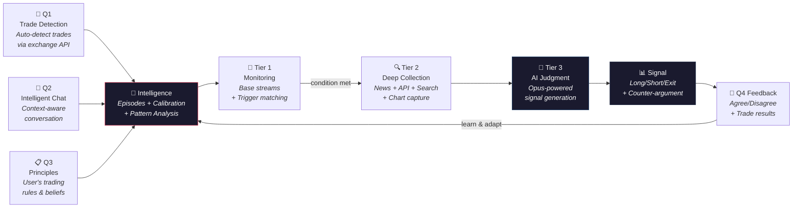
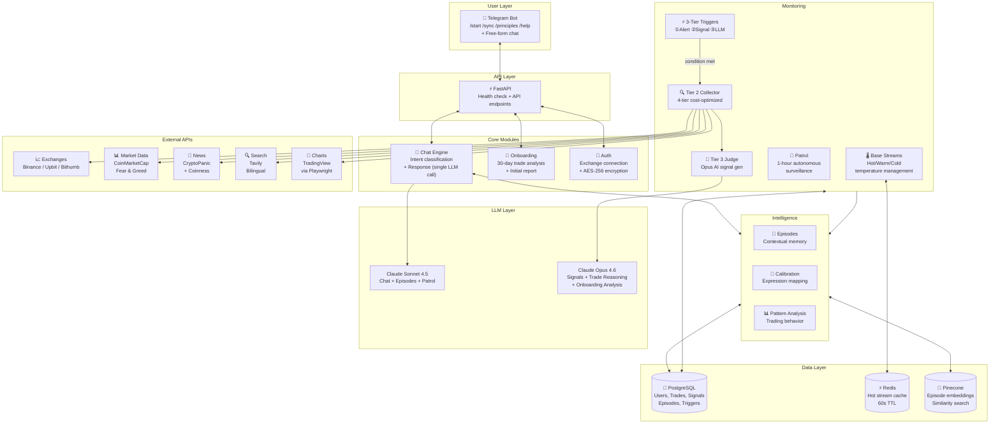
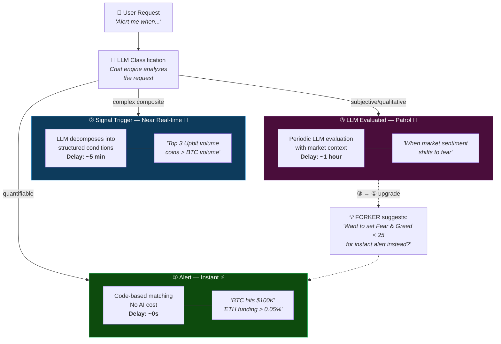
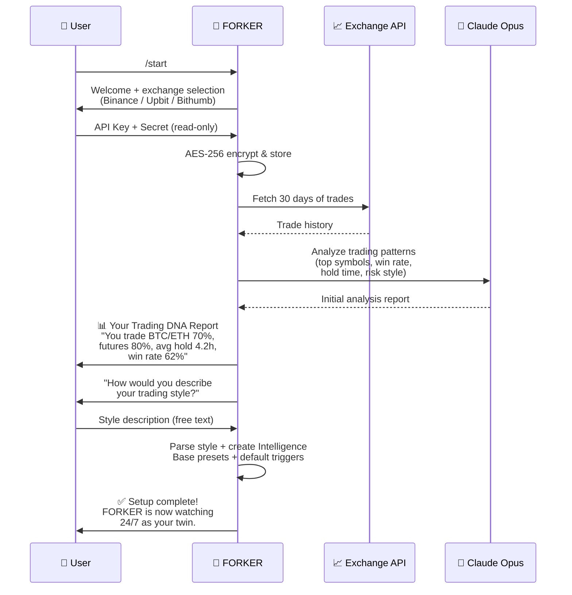

<div align="center">

# TRADEFORK

### Traders' Intelligence Twin Agent - FORKER 

[](https://python.org)
[](https://core.telegram.org/bots)
[](https://fastapi.tiangolo.com)
[](https://postgresql.org)
[](https://redis.io)
[](https://pinecone.io)
[](https://anthropic.com)

**Live on Telegram** · **Pro Tier** · **v4.2** · **8,100+ lines of production code**

[Architecture](#architecture) · [Features](#key-features) · [Tech Stack](#tech-stack) · [Quick Start](#quick-start) · [Roadmap](#roadmap)

</div>

---

## What is TRADEFORK?

Most crypto bots give the same signals to everyone. **TRADEFORK is the opposite.**

TRADEFORK is a **Traders' Intelligence Twin Agent** — it learns and replicates your trading & investing intelligence. Your know-how, your strategy, your perspective, your alpha. Each user gets a personal AI agent called **FORKER** that doesn't just track the market; it understands how *you* see the market and mirrors that back.

During onboarding, FORKER analyzes your last 30 days of trades to extract your patterns — preferred entries, risk tolerance, position sizing habits. It calibrates to your language (when you say *"it's dropping a bit"*, FORKER learns you mean roughly -3.2%). It internalizes your principles ("never chase pumps", "long only when funding < -0.1%"). Then it watches the market 24/7 through your lens.

Every signal is framed as **"as you would see it"**, not "we recommend." Every feedback you give — agree, disagree, or ignore — sharpens the model. The result is a feedback loop where your alpha compounds: **Q(data) → Intelligence(learning) → Signal(judgment) → Feedback → Q.**

**The longer you use it, the more it thinks like you.**

---

## Core Pipeline

Every feature in TRADEFORK is part of one unified loop:



---

## Architecture



---

## Key Features

| | Feature | Description |
|---|---------|-------------|
| 🔄 | **Q1 — Trade Auto-Detection** | Connects to Binance/Upbit/Bithumb via read-only API. Detects new trades in real-time, filters dust/deposits, and FORKER infers *your* reasoning using Opus AI. |
| 💬 | **Q2 — Intelligent Chat** | Every message enriched with full Intelligence context. Intent classification happens *inside* the same LLM call (zero extra cost). Autonomous web search when needed. |
| 📋 | **Q3 — Principles Management** | `/principles` — Add, edit, delete, or replace all your trading rules. FORKER references these in every signal and risk warning. |
| 📡 | **3-Tier Trigger System** | ① Instant alerts (code-based, 0 cost) ② Structured signals (~5 min) ③ LLM-evaluated conditions (~1 hour). LLM auto-upgrades ③→①. 3 sources: user_request, llm_auto, patrol. |
| 🎯 | **AI Signal Generation** | Opus-powered judgment with mandatory counter-arguments. 3-axis confidence (style match, historical similarity, market context), stop-loss levels, and "as you would see it" framing. |
| 📰 | **Daily Briefing** | Scheduled daily briefing at user-configured KST hour. Market overview (BTC/ETH/funding/F&G/kimchi premium), open positions, top news, active triggers with proximity, chart captures, and Intelligence-powered personalized commentary. `/dailybrief` to configure. |
| 🔄 | **Q4 — Feedback Loop** | Signal → Trade → Result → Learning. Agrees strengthen patterns, disagrees calibrate. Unfollowed signals teach FORKER your real preferences. |
| 📊 | **Sync Rate** | Quantifies how well FORKER knows you. Combines trade count, episodes, principles, calibrations, and recency into a single 0-100% score. |
| 🛡️ | **Security First** | AES-256 encrypted exchange keys, runtime-only decryption with immediate disposal, read-only API enforcement, no trade execution capability. |
| 🌡️ | **Smart Data Management** | Never deletes data. Hot (10s polling) → Warm (30 min) → Cold (Patrol only). Re-mention any asset = instant Hot restore. |
| 🌐 | **Bilingual Intelligence** | Korean users get English news analysis; English users get Korean market coverage. Tavily bilingual search built-in. |

---

## 3-Tier Trigger System

TRADEFORK maximizes real-time processing — every user request is pushed to the fastest possible tier:



---

## Onboarding Flow



---

## Tech Stack

| Layer | Technology | Role |
|-------|-----------|------|
| **Runtime** | Python 3.11+ | Fully async architecture |
| **API** | FastAPI + Uvicorn | API-first design, health checks |
| **Bot** | python-telegram-bot v21 | Async Telegram integration |
| **Database** | PostgreSQL + SQLAlchemy 2.0 | 12 tables, async ORM |
| **Cache** | Redis | Hot stream caching (60s TTL) |
| **Vector DB** | Pinecone Serverless | Episode embeddings (dim=1024, cosine) |
| **LLM** | Anthropic Claude API | Sonnet 4.5 + Opus 4.6, prompt caching |
| **Exchange** | ccxt | Binance, Upbit, Bithumb unified |
| **Search** | Tavily | Bilingual autonomous search |
| **Charts** | Playwright + TradingView | Headless chart capture |
| **News** | CryptoPanic + Coinness | Global + Korean crypto news |
| **Market Data** | CoinMarketCap, Alternative.me | Market cap, Fear & Greed |
| **Security** | cryptography (Fernet) | AES encrypted key storage |
| **Scheduler** | APScheduler | Patrol, temp mgmt, daily resets |
| **Deploy** | Railway (PaaS) | PostgreSQL + Redis add-ons |

---

## LLM Model Routing

| Function | Model | Rationale |
|----------|-------|-----------|
| Chat (Q2) | **Sonnet 4.5** | Fast response + cost efficiency for conversation |
| Episode Generation | **Sonnet 4.5** | Sufficient for memory extraction |
| Patrol Analysis | **Sonnet 4.5** | Periodic batch — speed over depth |
| **Signal Judgment (Tier 3)** | **Opus 4.6** | Maximum reasoning for trade decisions |
| **Trade Reasoning (Q1)** | **Opus 4.6** | Deep inference of user intent |
| **Onboarding Analysis** | **Opus 4.6** | First impression accuracy critical |

All LLM calls use **prompt caching** (`cache_control: ephemeral`) — up to 90% input cost reduction on static context (user profile, principles, patterns).

---

## Project Structure

```
TRADEFORK-v4.2/
├── src/
│   ├── main.py                    # FastAPI app + lifespan + scheduler
│   ├── config.py                  # Environment variables + constants
│   ├── bot/                       # Telegram bot layer
│   │   ├── handlers.py            #   /start, /sync, /principles, /dailybrief, /help + messages
│   │   ├── keyboards.py           #   Inline keyboards (onboarding, feedback, briefing time)
│   │   └── formatter.py           #   Message formatting utilities
│   ├── core/                      # Core business logic
│   │   ├── auth.py                #   User registration + exchange connection
│   │   ├── chat.py                #   Q2 chat engine (intent + response in one call)
│   │   ├── onboarding.py          #   Full onboarding flow (30-day analysis)
│   │   ├── briefing.py            #   Daily briefing (market + positions + news + charts + commentary)
│   │   └── sync_rate.py           #   Sync rate calculation (0-100%)
│   ├── intelligence/              # FORKER's brain
│   │   ├── episode.py             #   Episode CRUD + Intelligence context builder
│   │   ├── calibration.py         #   Expression calibration ("a bit down" = -3.2%)
│   │   ├── pattern.py             #   Trade pattern analysis (win rate, hold time...)
│   │   └── vector_store.py        #   Pinecone embedding + similarity search
│   ├── monitoring/                # Tier 1/2/3 surveillance
│   │   ├── base.py                #   Base streams + Hot/Warm/Cold temperature
│   │   ├── trigger.py             #   3-tier trigger evaluation (no AI for ①②)
│   │   ├── patrol.py              #   1-hour autonomous patrol
│   │   ├── collector.py           #   Tier 2 deep collection (4-tier cost optimization)
│   │   └── judge.py               #   Tier 3 Opus-powered signal generation
│   ├── exchange/                  # Exchange integration
│   │   ├── manager.py             #   ccxt unified manager (Binance/Upbit/Bithumb)
│   │   ├── trade_detector.py      #   Q1 trade detection + reasoning inference
│   │   └── position_tracker.py    #   Position/PnL tracking + commentary
│   ├── data/                      # External data sources
│   │   ├── market.py              #   Price, funding, OI, Fear&Greed, Kimchi premium
│   │   ├── news.py                #   CryptoPanic + Coinness news
│   │   ├── search.py              #   Tavily bilingual search
│   │   └── chart.py               #   TradingView chart capture (Playwright)
│   ├── llm/                       # LLM integration
│   │   ├── client.py              #   Anthropic client (caching + model routing)
│   │   ├── prompts.py             #   All system prompts
│   │   └── vision.py              #   Image analysis (chart screenshots)
│   ├── feedback/
│   │   └── processor.py           #   Q4 feedback loop (signal→trade→learn)
│   ├── security/
│   │   └── encryption.py          #   AES encrypted exchange key storage
│   └── db/
│       ├── models.py              #   SQLAlchemy models (12 tables)
│       ├── session.py             #   Async session factory
│       └── migrations.py          #   Auto table creation
├── docs/
│   ├── spec-v42.html              # Full specification (23 sections)
│   └── dev-prompt.md              # Phase-by-phase development guide
├── requirements.txt               # 19 production dependencies
├── Procfile                       # Railway web process
├── railway.toml                   # Railway build + deploy config
├── .env.example                   # Environment variable template
└── CLAUDE.md                      # AI-assisted development instructions
```

**42 source files · 8,100+ lines · 11 modules**

---

## Pro Tier Specifications

| Item | Value |
|------|-------|
| Patrol Interval | Every 1 hour (24 checks/day) |
| Signal Limit | 5 per day |
| Exchange Connections | Up to 3 |
| Signal AI | Claude Opus 4.6 |
| Chat AI | Claude Sonnet 4.5 |
| Base Hot Polling | Every 10 seconds |
| Base Warm Polling | Every 30 minutes |
| Trade Detection | Every 30 seconds |
| Rate Limit | 120 requests/min |

---

## Quick Start

```bash
# Clone
git clone https://github.com/dai-juju/TRADEFORK-v4.2.git
cd TRADEFORK-v4.2

# Install dependencies
pip install -r requirements.txt
playwright install chromium

# Configure environment
cp .env.example .env
# Edit .env with your API keys

# Run
python -m uvicorn src.main:app --host 0.0.0.0 --port 8000
```

Health check: `GET http://localhost:8000/health`

```json
{
  "status": "ok",
  "service": "tradefork",
  "version": "1.0.0",
  "users": 1,
  "scheduler": "running",
  "bot": "running"
}
```

---

## Environment Variables

| Variable | Required | Description |
|----------|----------|-------------|
| `TELEGRAM_BOT_TOKEN` | Yes | Telegram BotFather token |
| `ANTHROPIC_API_KEY` | Yes | Anthropic API key for Claude |
| `PINECONE_API_KEY` | Yes | Pinecone vector DB key |
| `PINECONE_INDEX_NAME` | No | Default: `tradefork-episodes` |
| `ENCRYPTION_KEY` | Yes | Fernet key for exchange API encryption |
| `TAVILY_API_KEY` | Yes | Tavily search API |
| `CMC_API_KEY` | No | CoinMarketCap API |
| `CRYPTOPANIC_API_KEY` | No | CryptoPanic news API |
| `DATABASE_URL` | Yes | PostgreSQL connection string |
| `REDIS_URL` | No | Redis connection (falls back to in-memory) |

---

## Scheduled Jobs

| Job | Interval | Method | Description |
|-----|----------|--------|-------------|
| Trade Detection | 30s | `asyncio.Task` | Poll exchange APIs for new trades |
| Base Hot Polling | 10s | `asyncio.Task` | Fetch real-time price/funding/OI |
| Base Warm Polling | 30m | Embedded cycle | Update less-active streams |
| Patrol | 1h | APScheduler | Autonomous surveillance + LLM triggers |
| Temperature Mgmt | 1h | APScheduler | Hot→Warm→Cold transitions |
| Signal Reset | 00:00 UTC | APScheduler (cron) | Reset daily signal counters |
| Trigger Cleanup | 1h | APScheduler | Remove 72h stale LLM triggers |
| Daily Briefing | 5m | APScheduler | Send briefing to users at their configured KST hour |

---

## Recent Updates (v4.2.1)

| Change | Description |
|--------|-------------|
| **3-Axis Confidence** | Signal confidence decomposed into 3 axes: style_match (30%), historical_similar (30%), market_context (40%). Unicode bar graph display in Telegram. Backward-compatible with single float. |
| **Daily Briefing** | Scheduled daily briefing with market overview, positions, news, active triggers (with proximity hints), chart captures, and Intelligence-based personalized commentary. Configurable via `/dailybrief` (KST 0-23 or OFF). Default: 8:00 KST. |
| **Typing Indicator** | Shows "💭 생각하는 중..." before LLM response for better UX. Error-resilient — falls back to new message on edit failure. |
| **Symbol Normalization** | Auto-strips trading pair suffixes (IRUSDT → IR, SOLUSDT → SOL) for accurate LLM recognition. Supports USDT/KRW/BTC/BUSD/USD/PERP. |
| **3-Source Trigger System** | Triggers now track their origin: `user_request` (user-initiated), `llm_auto` (FORKER proactive), `patrol` (anomaly-detected). Non-user triggers auto-delete after 72 hours. |
| **Patrol Auto-Triggers** | Patrol detects anomalies (price spikes, funding extremes, OI surges) and automatically creates `llm_evaluated` triggers for the user's primary symbols. |
| **Funding Rate Fix** | Trigger matching now uses `rate_pct` (percentage) instead of raw `rate` (decimal), ensuring conditions like "ETH funding < -0.1%" fire correctly. |
| **Episode Error Resilience** | Pinecone upsert failures no longer crash the chat pipeline. Session state is safely recovered via rollback. |
| **Proactive LLM Triggers** | FORKER now auto-generates monitoring triggers based on user patterns (e.g., funding alerts for funding-rate traders) with `source: llm_auto`. |

---

## Roadmap

- [x] Core Pipeline (Q → Intelligence → Tier 1/2/3 → Signal → Feedback)
- [x] Telegram Bot (4 commands + free-form chat)
- [x] 3-Tier Trigger System (Alert / Signal / LLM-evaluated)
- [x] Exchange Integration (Binance / Upbit / Bithumb)
- [x] Intelligence Module (Episodes + Calibration + Pattern Analysis)
- [x] Feedback Loop (Signal → Trade → Result → Learning)
- [x] Base Temperature Management (Hot / Warm / Cold)
- [x] Autonomous Patrol (1-hour surveillance)
- [x] Pro Tier — Complete
- [x] 3-Source Trigger System (user_request / llm_auto / patrol)
- [x] Patrol Auto-Trigger Generation
- [x] Symbol Normalization + Typing Indicator UX
- [x] 3-Axis Signal Confidence (style / history / market)
- [x] Daily Briefing + /dailybrief Command
- [ ] Basic / Enterprise Tiers
- [ ] Trading Intelligence Graph (TIG) — 3D investment intelligence visualization
- [ ] Electron Desktop App — capture user behavior logs to deepen learning
- [ ] Mobile App (React Native)
- [ ] Trading Intelligence Marketplace — buy, sell, and share proven trading strategies
- [ ] Trading Intelligence Community — connect with traders, compare styles, and learn from each other
- [ ] 100 Beta Users → Product-Market Fit validation

---

## Deployment

TRADEFORK is designed for **Railway** (PaaS) deployment:

```
railway up
```

Railway automatically:
1. Builds via Nixpacks
2. Installs Playwright + Chromium
3. Starts Uvicorn on `$PORT`
4. Health checks via `/health`
5. Auto-restarts on failure

**Add-ons required:** PostgreSQL + Redis

---

<div align="center">

**Built by Junsu Kim**

TRADEFORK — *Not a recommendation engine. Your intelligence twin.*

</div>
